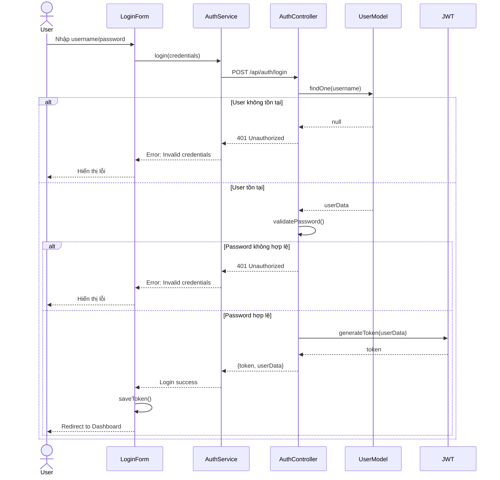
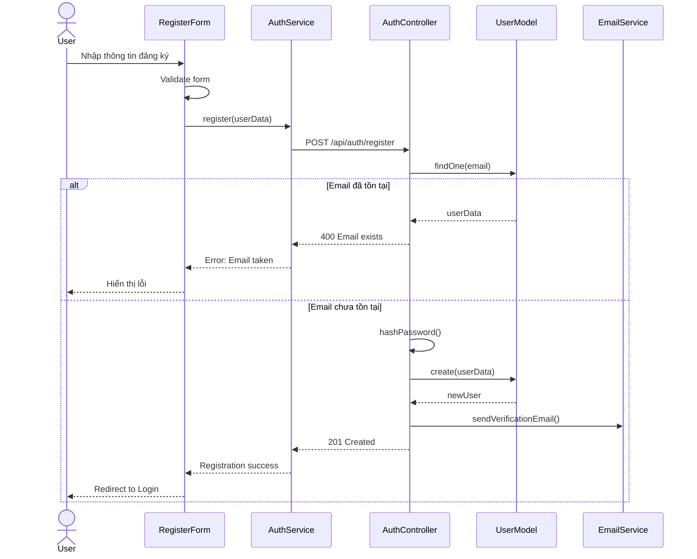
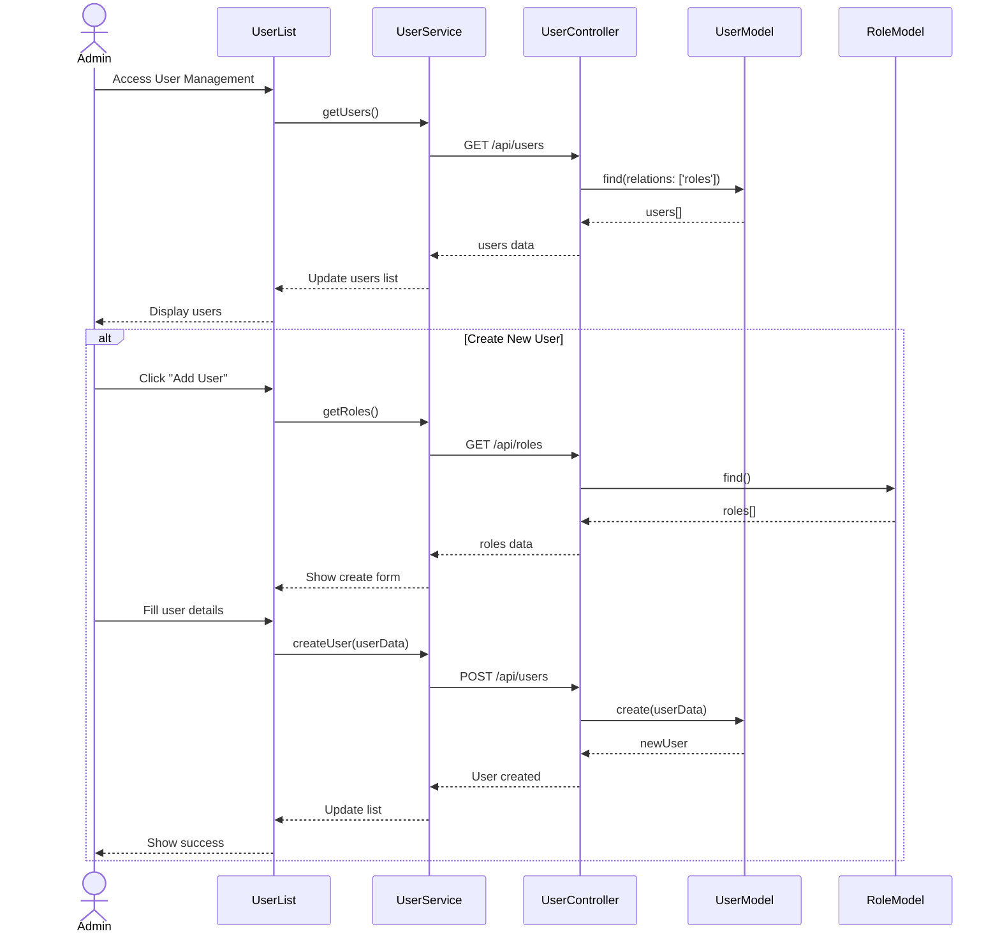
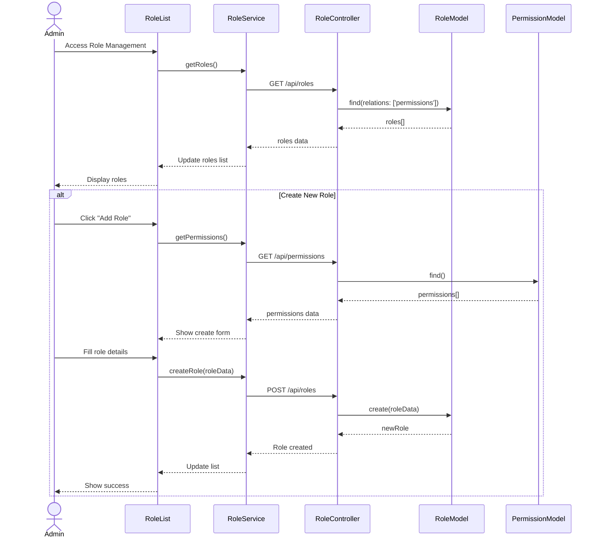
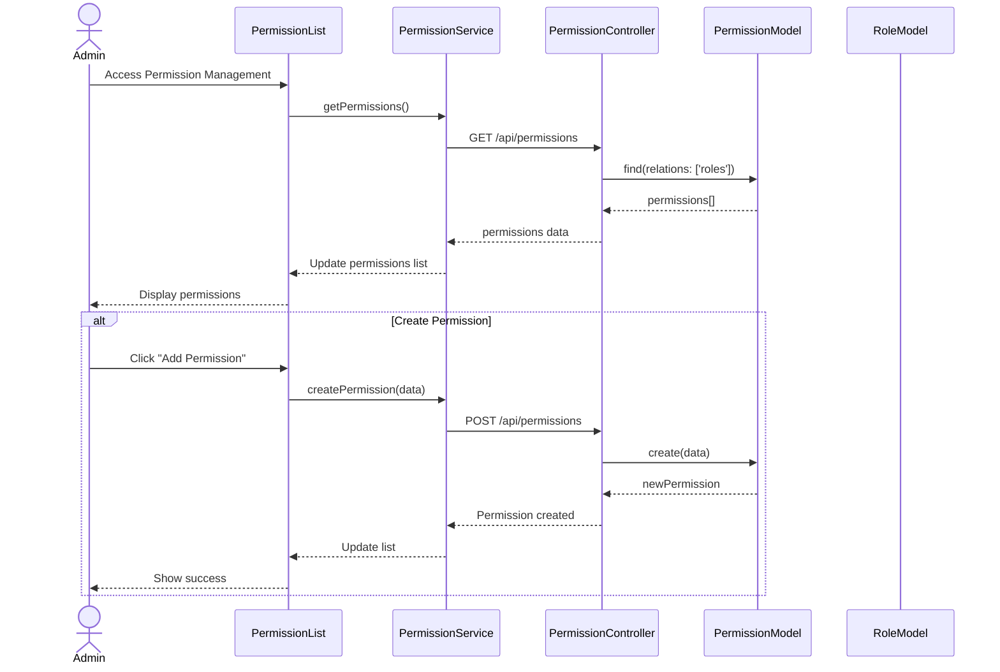
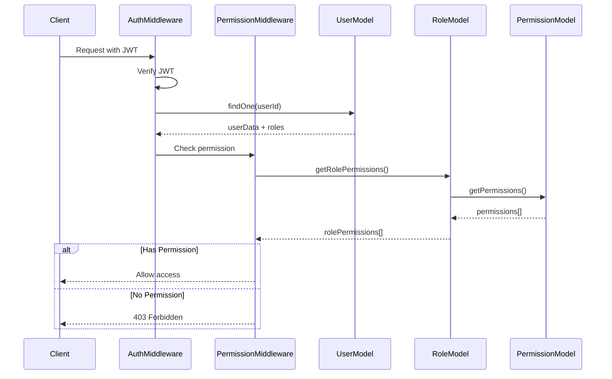
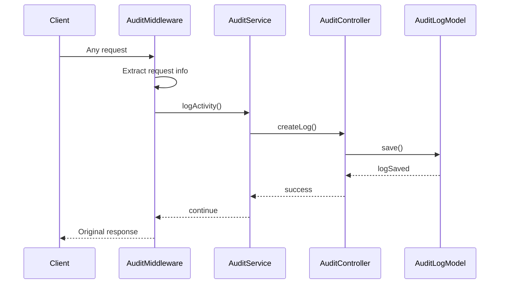
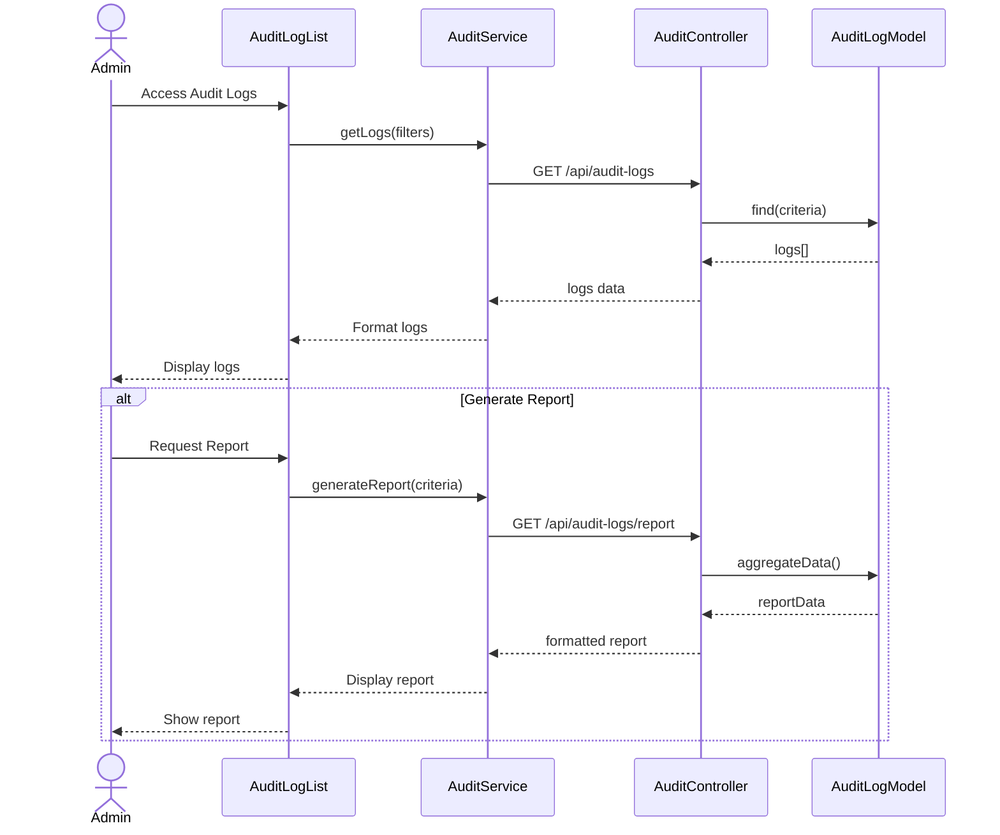

# PHÂN TÍCH LUỒNG XỬ LÝ HỆ THỐNG QUẢN LÝ PHÂN QUYỀN VÀ BẢO MẬT

## 1. Module Authentication

### 1.1 Luồng xử lý đăng nhập

**Giải thích chi tiết luồng đăng nhập:**

1. **Nhập thông tin đăng nhập:**
   - User nhập username và password vào LoginForm
   - Form thực hiện validate dữ liệu cơ bản ở client side

2. **Gửi yêu cầu đăng nhập:**
   - LoginForm đóng gói thông tin thành credentials
   - Gọi AuthService.login() với credentials

3. **Xử lý tại AuthService:**
   - AuthService tạo POST request đến endpoint /api/auth/login
   - Gửi credentials đến AuthController

4. **Xử lý tại AuthController:**
   - Controller tìm kiếm user trong database qua UserModel
   - Sử dụng username để tìm kiếm

5. **Kiểm tra tồn tại user:**
   - Nếu không tìm thấy user:
     + UserModel trả về null
     + AuthController trả về lỗi 401
     + Hiển thị thông báo "Invalid credentials"
   - Nếu tìm thấy user:
     + Tiếp tục kiểm tra password

6. **Xác thực mật khẩu:**
   - AuthController gọi validatePassword()
   - So sánh password đã hash với password trong database
   - Nếu không khớp:
     + Trả về lỗi 401
     + Hiển thị thông báo lỗi
   - Nếu khớp:
     + Tiến hành tạo JWT token

7. **Tạo và trả về token:**
   - JWT service tạo token từ userData
   - AuthController trả về token và userData
   - AuthService nhận và xử lý response

8. **Hoàn tất đăng nhập:**
   - LoginForm lưu token vào localStorage
   - Redirect user đến Dashboard
   - Cập nhật trạng thái đăng nhập trong app

### 1.2 Luồng xử lý đăng ký

**Giải thích chi tiết luồng đăng ký:**

1. **Nhập thông tin đăng ký:**
   - User điền form đăng ký với các thông tin:
     + Username
     + Email
     + Password
     + Confirm password
   - RegisterForm validate dữ liệu client-side:
     + Kiểm tra định dạng email
     + Kiểm tra độ mạnh password
     + Xác nhận password match

2. **Validate form và gửi request:**
   - RegisterForm thực hiện validate:
     + Kiểm tra các trường bắt buộc
     + Validate format email
     + Kiểm tra độ dài và format username
     + Validate password policy
   - Gọi AuthService.register() với userData

3. **Xử lý tại AuthService:**
   - AuthService tạo POST request đến /api/auth/register
   - Gửi userData đến AuthController
   - Xử lý các lỗi network nếu có

4. **Kiểm tra email tồn tại:**
   - AuthController tìm kiếm email trong database
   - Nếu email đã tồn tại:
     + Trả về lỗi 400 Bad Request
     + Message: "Email already exists"
     + RegisterForm hiển thị thông báo lỗi
   - Nếu email chưa tồn tại:
     + Tiếp tục quá trình đăng ký

5. **Tạo tài khoản mới:**
   - AuthController hash password với bcrypt
   - Tạo user mới trong database với:
     + Username
     + Email
     + Hashed password
     + Default role
     + Status: pending
   - Lưu thông tin vào UserModel

6. **Gửi email xác nhận:**
   - AuthController gọi EmailService
   - Tạo verification token
   - Gửi email với link xác nhận
   - Email chứa:
     + Welcome message
     + Verification link
     + Hướng dẫn kích hoạt

7. **Hoàn tất đăng ký:**
   - AuthController trả về status 201 Created
   - AuthService nhận response thành công
   - RegisterForm hiển thị thông báo:
     + Đăng ký thành công
     + Hướng dẫn check email
   - Redirect user đến trang đăng nhập

8. **Xử lý lỗi:**
   - Validate fails: Hiển thị lỗi tại form
   - Network error: Thông báo lỗi kết nối
   - Server error: Hiển thị message từ server
   - Timeout: Thông báo thử lại sau

## 2. Module User Management 

### 2.1 Luồng xử lý CRUD User

**Giải thích chi tiết luồng quản lý user:**

1. **Truy cập User Management:**
   - Admin truy cập vào trang User Management
   - UserList component được khởi tạo
   - Gọi UserService để lấy danh sách users

2. **Hiển thị danh sách users:**
   - UserService gửi GET request đến /api/users
   - UserController truy vấn database với relations roles
   - Trả về danh sách users kèm thông tin roles
   - UserList hiển thị dữ liệu dạng table

3. **Tạo user mới:**
   - Admin click nút "Add User"
   - UserList gọi UserService.getRoles() để lấy danh sách roles
   - Hiển thị form tạo user với các trường:
     + Username
     + Email
     + Password
     + Role selection
   - Sau khi điền form:
     + UserService gửi POST request với userData
     + UserController tạo user mới trong database
     + Cập nhật UI và hiển thị thông báo thành công

4. **Cập nhật user:**
   - Admin click "Edit" trên user row
   - Hiển thị form edit với dữ liệu hiện tại
   - Sau khi sửa đổi:
     + UserService gửi PUT request
     + UserController cập nhật trong database
     + Refresh danh sách users

5. **Xóa user:**
   - Admin click "Delete" trên user row
   - Hiển thị confirm dialog
   - Nếu xác nhận:
     + UserService gửi DELETE request
     + UserController xóa user khỏi database
     + Cập nhật UI

## 3. Module Role Management

### 3.1 Luồng xử lý quản lý vai trò

**Giải thích chi tiết luồng quản lý vai trò:**

1. **Truy cập Role Management:**
   - Admin truy cập trang Role Management
   - RoleList component khởi tạo
   - Gọi RoleService.getRoles() để lấy danh sách roles

2. **Hiển thị danh sách roles:**
   - RoleService gửi GET request đến /api/roles
   - RoleController truy vấn database kèm permissions
   - Trả về danh sách roles và permissions
   - RoleList hiển thị dữ liệu dạng table với các cột:
     + Role name
     + Description
     + Permissions
     + Actions

3. **Tạo role mới:**
   - Admin click "Add Role"
   - RoleList gọi getPermissions() để lấy danh sách permissions
   - Hiển thị form tạo role với các trường:
     + Role name
     + Description
     + Permission selection (multiple)
   - Sau khi submit:
     + RoleService gửi POST request với roleData
     + RoleController tạo role mới và liên kết permissions
     + Cập nhật UI và hiển thị thông báo

4. **Phân配 permissions cho role:**
   - Admin click "Edit Permissions" trên role
   - Hiển thị modal với danh sách permissions
   - Admin chọn/bỏ chọn permissions
   - Sau khi lưu:
     + RoleService gửi PUT request cập nhật permissions
     + RoleController cập nhật quan hệ role-permissions
     + Refresh danh sách roles

[Tiếp tục với Module Permission Management...]

## 4. Module Permission Management

### 4.1 Luồng xử lý quản lý quyền

**Giải thích chi tiết luồng quản lý quyền:**

1. **Truy cập Permission Management:**
   - Admin truy cập trang Permission Management
   - PermissionList component khởi tạo
   - Gọi PermissionService.getPermissions() để lấy danh sách permissions

2. **Hiển thị danh sách permissions:**
   - PermissionService gửi GET request đến /api/permissions
   - PermissionController truy vấn database với relations roles
   - Trả về danh sách permissions kèm thông tin roles đang sử dụng
   - PermissionList hiển thị dữ liệu dạng table với các cột:
     + Permission name
     + Resource
     + Action
     + Description
     + Roles using
     + Actions

3. **Tạo permission mới:**
   - Admin click "Add Permission"
   - Hiển thị form tạo permission với các trường:
     + Permission name
     + Resource type (users, roles, etc.)
     + Action (create, read, update, delete)
     + Description
   - Sau khi submit:
     + PermissionService gửi POST request với permissionData
     + PermissionController validate và tạo permission mới
     + Cập nhật UI và hiển thị thông báo thành công

4. **Cập nhật permission:**
   - Admin click "Edit" trên permission row
   - Hiển thị form edit với dữ liệu hiện tại
   - Sau khi sửa đổi:
     + PermissionService gửi PUT request
     + PermissionController cập nhật trong database
     + Kiểm tra và cập nhật các role liên quan
     + Refresh danh sách permissions

5. **Xóa permission:**
   - Admin click "Delete" trên permission row
   - Hệ thống kiểm tra xem permission có đang được sử dụng không
   - Nếu đang được sử dụng:
     + Hiển thị cảnh báo với danh sách roles đang dùng
     + Yêu cầu xác nhận xóa
   - Nếu xác nhận xóa:
     + PermissionService gửi DELETE request
     + PermissionController xóa permission và cập nhật các role liên quan
     + Cập nhật UI

6. **Xem roles sử dụng permission:**
   - Admin click vào số lượng roles trong cột "Roles using"
   - Hiển thị modal với danh sách roles đang sử dụng permission
   - Cho phép quick access để edit role từ modal này

### 4.2 Luồng xử lý kiểm tra quyền truy cập

**Giải thích chi tiết luồng kiểm tra quyền:**

1. **Nhận request từ client:**
   - Client gửi request kèm JWT token trong header
   - AuthMiddleware bắt request và verify token
   - Lấy userId từ token đã decode

2. **Kiểm tra thông tin user:**
   - AuthMiddleware query user từ database
   - Load thêm relations roles và permissions
   - Chuyển thông tin cho PermissionMiddleware

3. **Kiểm tra quyền truy cập:**
   - PermissionMiddleware nhận required permission từ route config
   - Lấy danh sách permissions của user thông qua roles
   - So sánh với required permission
   - Quyết định cho phép hoặc từ chối truy cập

4. **Xử lý kết quả:**
   - Nếu có quyền: Cho phép request tiếp tục
   - Nếu không có quyền: Trả về lỗi 403 Forbidden
   - Log lại hoạt động truy cập vào audit log

## 5. Module Audit & Logging

### 5.1 Luồng xử lý ghi nhận hoạt động

**Giải thích chi tiết luồng audit logging:**

1. **Bắt request từ client:**
   - AuditMiddleware được kích hoạt cho mọi request
   - Trích xuất thông tin từ request:
     + User ID (từ JWT token)
     + Request method
     + Request URL
     + IP address
     + Timestamp

2. **Xử lý thông tin audit:**
   - AuditService nhận thông tin từ middleware
   - Định dạng dữ liệu log:
     + Action type (CREATE, READ, UPDATE, DELETE)
     + Resource type (User, Role, Permission)
     + Resource ID
     + Changes made (nếu có)
     + Status (Success/Failure)

3. **Lưu trữ log:**
   - AuditController tạo bản ghi mới trong database
   - Thông tin được lưu vào AuditLogModel
   - Đảm bảo không làm ảnh hưởng tới performance của request chính

### 5.2 Luồng xử lý xem log và báo cáo

**Giải thích chi tiết luồng xem log và báo cáo:**

1. **Truy cập Audit Logs:**
   - Admin truy cập trang Audit Logs
   - AuditLogList component khởi tạo
   - Hiển thị form tìm kiếm với các filter:
     + Thời gian (từ - đến)
     + Loại hành động
     + User thực hiện
     + Resource type

2. **Tìm kiếm và lọc logs:**
   - Admin thiết lập các điều kiện lọc
   - AuditService gửi request với các parameters
   - AuditController thực hiện query với các điều kiện
   - Trả về danh sách logs phù hợp

3. **Hiển thị kết quả:**
   - Logs được hiển thị dạng table với các cột:
     + Timestamp
     + User
     + Action
     + Resource
     + Details
     + Status
   - Hỗ trợ phân trang và sắp xếp

4. **Tạo báo cáo:**
   - Admin chọn loại báo cáo:
     + Activity summary
     + User activity
     + Resource access
     + Security incidents
   - AuditService tổng hợp dữ liệu
   - Hiển thị báo cáo dạng biểu đồ và bảng
   - Cho phép export ra các định dạng khác nhau

5. **Cảnh báo bất thường:**
   - Hệ thống tự động phân tích logs
   - Phát hiện các pattern bất thường:
     + Nhiều lần đăng nhập thất bại
     + Truy cập bất thường
     + Thay đổi quyền đáng ngờ
   - Gửi thông báo cho admin
   - Lưu vào security log riêng